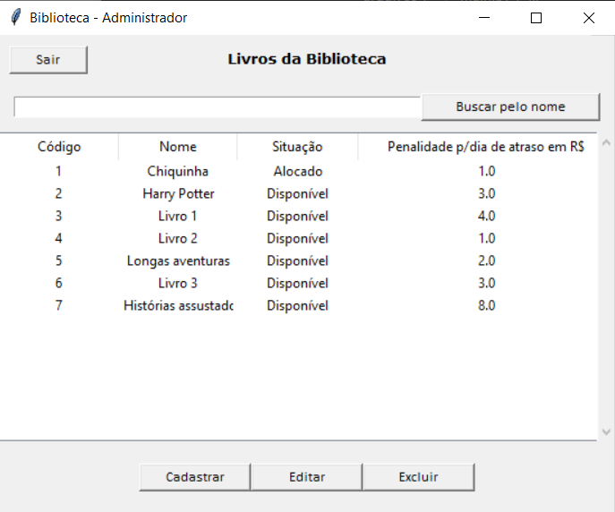
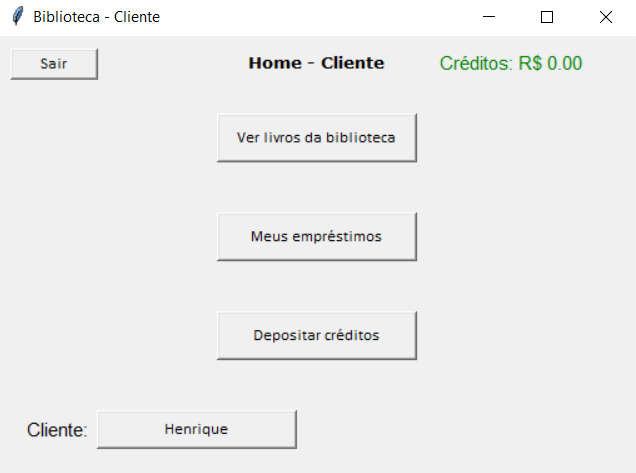
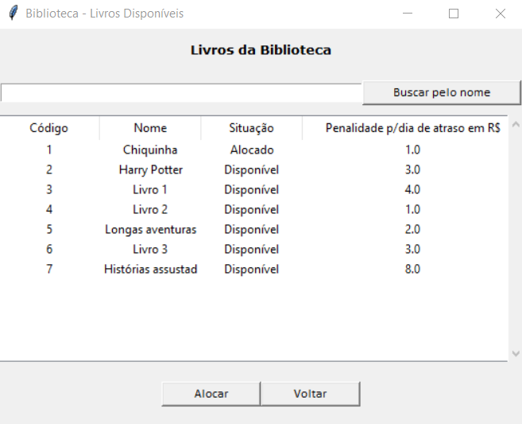
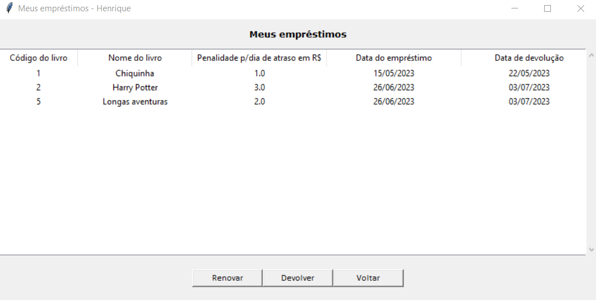

# ProjetoBiblioteca
Bem-vindo ao repositório do projeto desenvolvido para o trabalho final
da disciplina Programação Orientada a Objetos I! 
Este projeto foi desenvolvido como parte do curso e tem como objetivo demonstrar as 
habilidades adquiridas ao longo do semestre.

# Descrição e Funcionalidades
O projeto é uma aplicação de biblioteca, sendo desenvolvido utilizando Python. O 
objetivo principal é gerenciar uma biblioteca, de maneira que administradores 
possam controlar o acervo de livros, ao mesmo tempo que os clientes possam realizar
empréstimos de livros. Dentre suas funcionalidades:

1. Cadastrar/editar/excluir clientes;
2. Cadastrar/editar/excluir livros;
3. Realizar empréstimos de livros;
4. Renovação e devolução de livros;
5. Controle de multas e atrasos.

Além disso, outras funcionalidades podem ser encontradas no código-fonte e 
no resumo.

# Imagens

Tela principal do administrador: 

Tela principal do cliente: 

Tela de livros disponíveis para clientes: 

Tela de empréstimos do cliente: 

